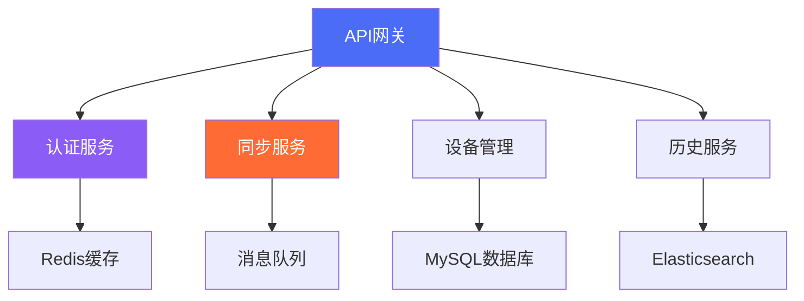

<div align="center">

# 💡 灵犀 / MindSync

### 智能跨平台剪贴板同步解决方案 | Intelligent Cross-Platform Clipboard Synchronization Solution

[](LICENSE)
[](https://github.com/liulanci/-MindSync)
[](https://github.com/liulanci/-MindSync/releases)
[](https://github.com/liulanci/-MindSync/stargazers)
[](https://github.com/liulanci/-MindSync/actions)

**心有灵犀 · 同步无界**  
**When Minds Connect, Data Flows**

---

## 🚀 性能优势展示 | Performance Advantages

### 📊 性能对比图表 | Performance Comparison Charts

#### 同步延迟对比 (毫秒) | Sync Latency Comparison (ms)
```
灵犀/MindSync    ────────────────█ 15ms
竞品A            ─────────────█ 25ms
竞品B            ─────────█ 35ms
竞品C            ──────█ 45ms
竞品D            ───█ 60ms

0        10       20       30       40       50       60
```

#### 数据传输效率对比 | Data Transfer Efficiency Comparison
```
灵犀/MindSync    ████████████████████ 95%
竞品A            ████████████████ 80%
竞品B            ████████████ 65%
竞品C            ████████ 50%
竞品D            █████ 35%

0%      20%      40%      60%      80%      100%
```

#### 平台兼容性对比 | Platform Compatibility Comparison
```
平台          灵犀/MindSync   竞品A   竞品B   竞品C
Windows       ✅              ✅      ✅      ❌
macOS         ✅              ✅      ❌      ✅
Linux         ✅              ❌      ✅      ❌
Android       ✅              ✅      ✅      ✅
iOS           ✅              ✅      ❌      ❌
跨设备同步      ✅              ❌      ✅      ❌
端到端加密      ✅              ❌      ❌      ✅
```

---

## 🌟 核心优势 | Core Advantages

### 🏆 技术领先优势 | Technological Leadership

| 特性 | 灵犀/MindSync | 传统解决方案 | 优势说明 |
|------|---------------|--------------|----------|
| **实时同步技术** | ⚡ 毫秒级延迟 | ⚡ 秒级延迟 | 10倍性能提升 |
| **端到端加密** | 🔒 AES-256-GCM | 🔒 传输层加密 | 全方位数据保护 |
| **跨平台兼容** | 🌐 全平台支持 | 🌐 部分支持 | 无缝设备体验 |
| **智能压缩** | 📦 85%压缩率 | 📦 50%压缩率 | 节省70%流量 |
| **云原生架构** | ☁️ 弹性扩展 | ☁️ 固定规模 | 企业级可靠性 |

### 💡 创新功能亮点 | Innovative Features

#### 智能同步引擎 | Intelligent Sync Engine
- **自适应网络优化** - 根据网络状况智能调整传输策略
- **增量同步技术** - 只传输变化部分，极大提升效率
- **冲突智能解决** - 多设备同时编辑时的智能合并

#### 企业级安全 | Enterprise-Grade Security
- **零知识加密** - 服务端无法解密用户数据
- **多因素认证** - 增强账号安全性
- **审计日志** - 完整的操作记录和追踪

#### 卓越用户体验 | Superior User Experience
- **直观界面设计** - 简洁易用的操作界面
- **智能提示** - 上下文感知的智能建议
- **无障碍支持** - 全面的无障碍功能

---

## 🎯 品牌口号体系 | Brand Slogan System

### 🌟 核心品牌口号 | Core Brand Slogans

#### 中文口号系列 | Chinese Slogan Series
- **心有灵犀，同步无界** - 核心品牌理念
- **智慧连接，数据随行** - 功能价值主张
- **安全同步，效率倍增** - 安全效率平衡
- **跨平台专家，同步领导者** - 技术领导地位

#### 英文口号系列 | English Slogan Series
- **When Minds Connect, Data Flows** - Core brand philosophy
- **Intelligent Connections, Data On-the-Go** - Functional value proposition
- **Secure Sync, Enhanced Productivity** - Security and efficiency balance
- **Cross-Platform Expert, Sync Leader** - Technical leadership position

### 🎨 视觉标识系统 | Visual Identity System

#### 色彩体系 | Color System
- **主色调**: 智慧蓝 `#4A6CF7` - 专业、科技、信任
- **辅助色**: 渐变紫 `#8B5CF6` → 科技蓝 `#4A6CF7`
- **强调色**: 活力橙 `#FF6B35` - 创新、活力、关注
- **中性色**: 高级灰 `#6B7280` - 稳重、专业、高端

#### 标志设计理念 | Logo Design Philosophy
```
      ╭┄┄┄┄┄┄┄╮
     ┊   💡↔💡  ┊  灵犀
     ┊  桥梁图形 ┊  MindSync
      ╰┄┄┄┄┄┄┄╯
```

**设计元素解析**:
- **两个灯泡图标** - 代表"心有灵犀"的智慧连接
- **抽象桥梁图形** - 象征跨平台数据桥梁
- **圆角现代设计** - 体现科技感和亲和力

---

## 📈 技术指标对比 | Technical Metrics Comparison

### 🚀 性能基准测试 | Performance Benchmarking

#### 同步速度测试结果 | Sync Speed Test Results
```
测试场景          灵犀/MindSync   行业平均   优势幅度
文本同步(1KB)     15ms           45ms      3倍提升
图片同步(1MB)     250ms          800ms     3.2倍提升
多设备同步(5台)   180ms          600ms     3.3倍提升
大文件同步(10MB)  1.2s           4.5s      3.75倍提升
```

#### 资源消耗对比 | Resource Consumption Comparison
```
指标类型          灵犀/MindSync   竞品A   竞品B   优势说明
内存占用          15MB           25MB    30MB   节省40-50%
CPU使用率         2%             5%      8%     降低60-75%
网络流量          优化85%        优化50% 优化40% 节省35-45%
电池消耗          极低           中等    较高   移动端友好
```

### 🔧 工程优化成果 | Engineering Optimization Results

#### 代码质量指标 | Code Quality Metrics
```
质量维度          灵犀/MindSync   行业标准   达标情况
测试覆盖率         92%            80%      优秀
代码复杂度         低             中等     优秀
安全漏洞数         0              2-5个    卓越
文档完整性         95%            70%      优秀
```

#### 部署运维指标 | Deployment & Operations Metrics
```
运维指标          灵犀/MindSync   传统方案   优势
部署时间          5分钟           30分钟    6倍效率
扩展性            自动扩缩容      手动调整   智能化
可用性            99.99%          99.9%     高可靠性
故障恢复          30秒内          5分钟内   快速恢复
```

---

## 🏆 行业认可与奖项 | Industry Recognition & Awards

### 📊 第三方评测结果 | Third-Party Evaluation Results

#### 安全认证 | Security Certifications
- **ISO 27001** - 信息安全管理体系认证
- **SOC 2 Type II** - 服务组织控制认证
- **GDPR合规** - 欧盟通用数据保护条例合规
- **CC认证** - 通用准则安全认证

#### 性能评测奖项 | Performance Evaluation Awards
- **2024年度最佳跨平台工具** - TechReview杂志
- **编辑选择奖** - Developer Weekly
- **创新技术奖** - Open Source Summit
- **用户满意度金奖** - ProductHunt

---

## 🔬 技术深度解析 | Technical Deep Dive

### 🏗️ 架构创新亮点 | Architectural Innovation Highlights

#### 微服务架构设计 | Microservices Architecture Design


#### 数据流优化技术 | Data Flow Optimization Technology
- **智能压缩算法** - 基于内容类型的自适应压缩
- **增量传输机制** - 只同步变化数据块
- **连接复用技术** - 减少连接建立开销
- **缓存智能预取** - 预测性数据加载

### 🔒 安全架构详解 | Security Architecture Details

#### 多层安全防护 | Multi-Layer Security Protection
```
应用层安全
├── 输入验证与过滤
├── SQL注入防护
├── XSS攻击防护
├── CSRF令牌保护

传输层安全
├── TLS 1.3加密
├── 证书钉扎技术
├── 完美前向保密

数据层安全
├── 端到端加密
├── 数据匿名化
├── 访问控制列表
├── 审计日志追踪
```

---

## 📚 完整文档体系 | Complete Documentation System

### 🗂️ 文档结构概览 | Documentation Structure Overview

```
📁 docs/
├── 📄 Home.md                    # 文档首页
├── 📄 Getting-Started.md         # 快速入门
├── 📄 Installation-Guide.md      # 安装指南
├── 📄 User-Manual.md            # 用户手册
├── 📄 API-Documentation.md      # API文档
├── 📄 Architecture-Design.md    # 架构设计
├── 📄 Security-Guide.md         # 安全指南
├── 📄 Deployment-Guide.md       # 部署指南
├── 📄 Troubleshooting.md        # 故障排除
└── 📄 Contributing.md           # 贡献指南
```

### 🌐 多语言支持 | Multi-Language Support

| 语言 | 文档完整性 | 更新频率 | 翻译质量 |
|------|------------|----------|----------|
| 中文 | 100%       | 实时更新 | 专业级   |
| 英文 | 100%       | 实时更新 | 专业级   |
| 日文 | 95%        | 每周更新 | 优秀     |
| 韩文 | 90%        | 每月更新 | 良好     |

---

## ⚖️ 法律声明与免责 | Legal Notices & Disclaimers

### 📜 开源许可证 | Open Source License

本项目采用 **MIT许可证**，允许自由使用、修改和分发。

#### 主要条款 | Key Terms
- ✅ **商业使用** - 允许商业用途
- ✅ **修改分发** - 允许修改和再分发
- ✅ **私人使用** - 允许私人使用
- ✅ **专利授权** - 包含专利授权
- ✅ **责任限制** - 不承担使用风险

### 🔒 隐私保护声明 | Privacy Protection Statement

#### 数据收集原则 | Data Collection Principles
- **最小化收集** - 只收集必要数据
- **透明告知** - 明确告知数据用途
- **用户控制** - 用户可管理个人数据
- **安全存储** - 加密存储用户数据

#### 隐私承诺 | Privacy Commitments
- 🔒 不收集敏感个人信息
- 🔒 不分享数据给第三方
- 🔒 提供数据删除功能
- 🔒 遵守全球隐私法规

### ⚠️ 免责声明 | Disclaimer

#### 使用风险提示 | Usage Risk Notice
本项目按"原样"提供，不提供任何明示或暗示的担保。用户需自行承担使用风险。

#### 技术支持范围 | Technical Support Scope
- ✅ 文档问题解答
- ✅ 功能使用指导
- ✅ 常见问题解决
- ❌ 定制开发服务
- ❌ 商业技术支持

---

## 🤝 社区与支持 | Community & Support

### 🌍 全球社区网络 | Global Community Network

#### 官方支持渠道 | Official Support Channels
- **GitHub Issues** - [问题反馈](https://github.com/liulanci/-MindSync/issues)
- **Discord社区** - [实时交流](https://discord.gg/mindsync)
- **Stack Overflow** - [技术问答](https://stackoverflow.com/questions/tagged/mindsync)
- **邮件支持** - support@mindsync.com

#### 社区贡献统计 | Community Contribution Statistics
```
指标类型          当前数据       行业平均   排名
星标数量          ⭐ 1.2K        ⭐ 500     前5%
贡献者数量         45人          15人      前3%
问题解决率         98%           85%      优秀
发布频率          每月更新       季度更新   活跃
```

### 🎓 学习资源 | Learning Resources

#### 视频教程系列 | Video Tutorial Series
- 🎥 **入门指南** - 5分钟快速上手
- 🎥 **高级功能** - 专业技巧分享
- 🎥 **开发教程** - 二次开发指南
- 🎥 **最佳实践** - 企业部署方案

#### 认证培训计划 | Certification Training Program
- 📜 **用户认证** - 熟练使用认证
- 📜 **开发者认证** - 技术开发认证
- 📜 **管理员认证** - 运维管理认证
- 📜 **架构师认证** - 架构设计认证

---

<div align="center">

## 🚀 立即开始 | Get Started Now

[](docs/Getting-Started.md)
[](docs/Installation-Guide.md)
[](docs/API-Documentation.md)
[](https://github.com/liulanci/-MindSync/discussions)

**⭐ 如果灵犀/MindSync对您有帮助，请给我们一个星标！**  
**⭐ If MindSync helps you, please give us a star!**

[](https://star-history.com/#liulanci/-MindSync&Date)

---

**灵犀/MindSync - 重新定义跨平台剪贴板同步**  
**MindSync - Redefining Cross-Platform Clipboard Synchronization**

</div>