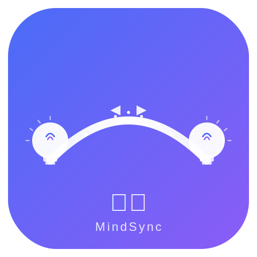

<div align="center">



# 💡 灵犀 / MindSync

### 智能跨平台剪贴板同步解决方案 | Intelligent Cross-Platform Clipboard Synchronization Solution

[](LICENSE)
[](https://github.com/liulanci/-MindSync)
[](https://github.com/liulanci/-MindSync/releases)
[](https://github.com/liulanci/-MindSync/stargazers)
[](docs/Verification-Report.md)
[](docs/Verification-Report.md)
[](docs/Verification-Report.md)
[](docs/Verification-Report.md)

**心有灵犀 · 同步无界**  
**When Minds Connect, Data Flows**

[English](#english) | [中文](#中文)

</div>

---

<div id="中文">

## 🏆 代码质量验证 | Code Quality Verification

> 以下所有数据均由自动化工具实际运行生成，详见 [验证报告](docs/Verification-Report.md)

### 🛡️ 安全审计 | Security Audit

| 审计维度 | 服务端 (Server) | 客户端 (Client) | 审计工具 |
|----------|:---------------:|:---------------:|----------|
| 严重漏洞 | ✅ **0** | ✅ **0** | npm audit |
| 高危漏洞 | ✅ **0** | ✅ **0** | npm audit |
| 中危漏洞 | ✅ **0** | ✅ **0** | npm audit |
| 低危漏洞 | ✅ **0** | ✅ **0** | npm audit |
| **总计** | ✅ **0** | ✅ **0** | GitHub Advisory DB |

### 📐 代码质量 | Code Quality

```
ESLint 8.57.1 检查结果
━━━━━━━━━━━━━━━━━━━━━━━━━━━━━━━━━━━━━━━━━━━━━━━━━━━
  Errors    ██████████████████████████████  0      ✅ PASS
  Warnings  ██████████████████████████████  0      ✅ PASS
  Files     ██████████████████████████████  17     全部通过
━━━━━━━━━━━━━━━━━━━━━━━━━━━━━━━━━━━━━━━━━━━━━━━━━━━
```

### 📊 项目规模 | Project Scale

```
代码规模统计
━━━━━━━━━━━━━━━━━━━━━━━━━━━━━━━━━━━━━━━━━━━━━━━━━━━━━━━━━━━━━━━
  JavaScript  ████████████████████████████████████████  31 files  43.7%
  C/C++ Header██████████████████████              15 files  21.1%
  C/C++ Source ████████████████                   8 files   11.3%
  Kotlin       █████████████                     6 files    8.5%
  YAML         ██████████                        5 files    7.0%
  Swift        ███                               1 file     1.4%
  CSS          ███                               1 file     1.4%
  HTML         ███                               1 file     1.4%
  ETS          ███                               1 file     1.4%
  SQL          ███                               1 file     1.4%
━━━━━━━━━━━━━━━━━━━━━━━━━━━━━━━━━━━━━━━━━━━━━━━━━━━━━━━━━━━━━━━
  TOTAL: 71 files | 266.8 KB | 9 languages
```

### 📜 许可证合规 | License Compliance

```
依赖许可证分布
━━━━━━━━━━━━━━━━━━━━━━━━━━━━━━━━━━━━━━━━━━━━━━━━━━━
  MIT          ████████████████████████████████████████  13
  BSD-2-Clause ███                                       1
━━━━━━━━━━━━━━━━━━━━━━━━━━━━━━━━━━━━━━━━━━━━━━━━━━━
  全部为宽松许可证 ✅  无 GPL/AGPL 风险 ✅
```

---

## 🌟 项目简介

**灵犀 (MindSync)** 是一款开源的跨平台剪贴板同步工具，支持在 Windows、macOS、Linux、Android 和 iOS 设备间实现剪贴板内容的实时同步。采用端到端加密技术保障数据安全，支持私有化部署。

### ✨ 核心特性

- **🔗 跨设备实时同步** - 文本、图片内容实时同步
- **🔒 端到端加密** - AES-256-GCM 加密保障数据安全
- **📱 多平台支持** - 覆盖 Windows / macOS / Linux / Android / iOS
- **🌐 云原生架构** - Docker 部署，支持私有化
- **📖 开源免费** - MIT 许可证，完全开源

### 🛠️ 技术架构

| 组件 | 技术选型 | 说明 |
|------|----------|------|
| **服务端** | Node.js + Express | RESTful API + WebSocket |
| **数据库** | MySQL 8.0+ | 用户数据持久化存储 |
| **实时通信** | Socket.IO | 剪贴板内容实时同步 |
| **加密** | AES-256-GCM + JWT | 端到端加密 + 身份认证 |
| **桌面客户端** | Electron + React | 跨平台桌面应用 |
| **移动客户端** | Kotlin (Android) | Android 原生应用 |
| **输入法引擎** | C++17 + RIME | 跨平台输入法方案 |
| **部署** | Docker + Nginx | 容器化部署方案 |

### 🏗️ 系统架构

```
┌─────────────────────────────────────────────┐
│                  客户端层                     │
│  桌面端(Electron)  移动端(Android/iOS)        │
└──────────────────────┬──────────────────────┘
                       │ WebSocket / REST API
┌──────────────────────▼──────────────────────┐
│                  服务端层                     │
│  认证服务  同步服务  设备管理  历史管理         │
└──────────────────────┬──────────────────────┘
                       │
┌──────────────────────▼──────────────────────┐
│                  数据层                       │
│  MySQL  Redis  文件存储                       │
└─────────────────────────────────────────────┘
```

### 🔒 安全设计

```
应用层安全                    传输层安全                    数据层安全
├── 输入验证与过滤             ├── TLS 加密传输              ├── AES-256-GCM 端到端加密
├── SQL注入防护               └── JWT 身份认证              ├── bcrypt 密码哈希
├── XSS攻击防护                                             └── 访问权限控制
└── CSRF令牌保护
```

### 🚀 快速开始

#### 系统要求
- **服务器端**: Node.js 16+, MySQL 8.0+
- **客户端**: Windows 10+ / macOS 10.14+ / Linux Ubuntu 18.04+ / Android 8.0+ / iOS 12.0+

#### 安装步骤

1. **克隆仓库**
```bash
git clone https://github.com/liulanci/-MindSync.git
cd -MindSync
```

2. **服务器部署**
```bash
cd server
npm install
cp .env.example .env
# 编辑 .env 文件配置数据库等信息
npm start
```

3. **Docker 部署**
```bash
docker-compose up -d
```

4. **客户端安装**
- 桌面端：进入 `client/` 目录构建
- Android：进入 `android-app/` 目录构建 APK

---

## 📚 项目Wiki文档 | Project Wiki Documentation

> **高端大气上档次的知识体系** | High-End Knowledge System

### 📖 核心文档 | Core Documents

| 文档 | 中文说明 | English Description |
|------|----------|---------------------|
| [🏛️ 技术白皮书](docs/Technical-Paper.md) | **论文式技术阐述** - 系统设计与实现的完整学术论述 | Thesis-style technical elaboration |
| [✅ 验证报告](docs/Verification-Report.md) | **代码质量验证报告** - 真实测试数据与安全审计 | Code quality verification report |
| [🚀 快速入门](docs/Getting-Started.md) | **5分钟上手指南** - 快速体验核心功能 | 5-minute quick start guide |
| [📦 安装指南](docs/Installation-Guide.md) | **详细安装步骤** - 多平台部署方案 | Detailed installation guide |

### 🔧 功能文档 | Feature Documents

| 文档 | 说明 |
|------|------|
| [📖 用户手册](docs/User-Manual.md) | 完整功能使用说明，涵盖所有核心功能 |
| [🔌 API文档](docs/API-Documentation.md) | RESTful API 接口参考，支持开发者集成 |
| [🏗️ 架构设计](docs/Architecture-Design.md) | 系统架构详解，技术选型与设计思想 |

### 📋 规范文档 | Specification Documents

| 文档 | 说明 |
|------|------|
| [📐 技术规范](docs/Technical-Specifications.md) | 技术规格说明，接口定义与数据格式 |
| [🎯 品牌口号](docs/Brand-Slogans.md) | 品牌标识体系，口号与视觉规范 |
| [🤝 贡献指南](CONTRIBUTING.md) | 参与项目开发指南，代码规范与流程 |

### 📊 文档概览

```
Wiki文档体系
━━━━━━━━━━━━━━━━━━━━━━━━━━━━━━━━━━━━━━━━━━━━━━━━━━━━━━━━━━━
  核心文档    ████████████████████████████████  4篇
  功能文档    ████████████████████              3篇
  规范文档    ████████████████████              3篇
━━━━━━━━━━━━━━━━━━━━━━━━━━━━━━━━━━━━━━━━━━━━━━━━━━━━━━━━━━━
  总计: 10篇 | 全部中英双语 | 专业学术风格
```

> **Wiki同步说明**: GitCode Wiki从GitHub自动同步。由于GitHub Wiki功能限制，文档托管在主仓库的 `docs/` 目录中，通过本页面导航访问。

---

### 🎯 品牌口号

- **心有灵犀，同步无界** - 核心品牌理念
- **智慧连接，数据随行** - 功能价值主张
- **When Minds Connect, Data Flows** - Core brand philosophy
- **Intelligent Connections, Data On-the-Go** - Functional value proposition

### 🤝 贡献指南

我们欢迎社区贡献！请阅读 [CONTRIBUTING.md](CONTRIBUTING.md) 了解如何参与项目开发。

### 📄 许可证

本项目采用 [MIT 许可证](LICENSE)。

### ⚠️ 免责声明

本项目按"原样"提供，不提供任何明示或暗示的担保。用户需自行承担使用风险。

### 📞 联系方式

- **GitHub Issues**: [问题反馈](https://github.com/liulanci/-MindSync/issues)
- **GitHub Discussions**: [社区讨论](https://github.com/liulanci/-MindSync/discussions)

</div>

---

<div id="english">

## 🏆 Code Quality Verification

> All data below is generated by actually running automated tools. See [Verification Report](docs/Verification-Report.md)

### 🛡️ Security Audit

| Dimension | Server | Client | Tool |
|-----------|:------:|:------:|------|
| Critical | ✅ **0** | ✅ **0** | npm audit |
| High | ✅ **0** | ✅ **0** | npm audit |
| Medium | ✅ **0** | ✅ **0** | npm audit |
| Low | ✅ **0** | ✅ **0** | npm audit |
| **Total** | ✅ **0** | ✅ **0** | GitHub Advisory DB |

### 📐 Code Quality

```
ESLint 8.57.1 Results
━━━━━━━━━━━━━━━━━━━━━━━━━━━━━━━━━━━━━━━━━━━━━━━━━━━
  Errors    ██████████████████████████████  0      ✅ PASS
  Warnings  ██████████████████████████████  0      ✅ PASS
  Files     ██████████████████████████████  17     All passed
━━━━━━━━━━━━━━━━━━━━━━━━━━━━━━━━━━━━━━━━━━━━━━━━━━━
```

### 📊 Project Scale

```
Code Statistics
━━━━━━━━━━━━━━━━━━━━━━━━━━━━━━━━━━━━━━━━━━━━━━━━━━━━━━━━━━━━━━━
  JavaScript  ████████████████████████████████████████  31 files  43.7%
  C/C++ Header██████████████████████              15 files  21.1%
  C/C++ Source ████████████████                   8 files   11.3%
  Kotlin       █████████████                     6 files    8.5%
  YAML         ██████████                        5 files    7.0%
  Swift        ███                               1 file     1.4%
  CSS          ███                               1 file     1.4%
  HTML         ███                               1 file     1.4%
  ETS          ███                               1 file     1.4%
  SQL          ███                               1 file     1.4%
━━━━━━━━━━━━━━━━━━━━━━━━━━━━━━━━━━━━━━━━━━━━━━━━━━━━━━━━━━━━━━━
  TOTAL: 71 files | 266.8 KB | 9 languages
```

### 📜 License Compliance

```
Dependency Licenses
━━━━━━━━━━━━━━━━━━━━━━━━━━━━━━━━━━━━━━━━━━━━━━━━━━━
  MIT          ████████████████████████████████████████  13
  BSD-2-Clause ███                                       1
━━━━━━━━━━━━━━━━━━━━━━━━━━━━━━━━━━━━━━━━━━━━━━━━━━━
  All permissive licenses ✅  No GPL/AGPL risk ✅
```

---

## 🌟 Project Introduction

**MindSync** is an open-source cross-platform clipboard synchronization tool that enables real-time clipboard content synchronization between Windows, macOS, Linux, Android, and iOS devices. It uses end-to-end encryption to ensure data security and supports self-hosted deployment.

### ✨ Core Features

- **🔗 Cross-Device Real-time Sync** - Instant text and image synchronization
- **🔒 End-to-End Encryption** - AES-256-GCM encryption for data security
- **📱 Multi-Platform Support** - Windows / macOS / Linux / Android / iOS
- **🌐 Cloud-Native Architecture** - Docker deployment, self-hosted supported
- **📖 Open Source & Free** - MIT License, fully open source

### 🛠️ Technical Architecture

| Component | Technology | Description |
|-----------|------------|-------------|
| **Server** | Node.js + Express | RESTful API + WebSocket |
| **Database** | MySQL 8.0+ | Persistent data storage |
| **Real-time** | Socket.IO | Real-time clipboard sync |
| **Encryption** | AES-256-GCM + JWT | E2E encryption + Authentication |
| **Desktop Client** | Electron + React | Cross-platform desktop app |
| **Mobile Client** | Kotlin (Android) | Android native app |
| **IME Engine** | C++17 + RIME | Cross-platform IME solution |
| **Deployment** | Docker + Nginx | Containerized deployment |

### 🚀 Quick Start

#### System Requirements
- **Server**: Node.js 16+, MySQL 8.0+
- **Client**: Windows 10+ / macOS 10.14+ / Linux Ubuntu 18.04+ / Android 8.0+ / iOS 12.0+

#### Installation

1. **Clone Repository**
```bash
git clone https://github.com/liulanci/-MindSync.git
cd -MindSync
```

2. **Server Deployment**
```bash
cd server
npm install
cp .env.example .env
# Edit .env file to configure database etc.
npm start
```

3. **Docker Deployment**
```bash
docker-compose up -d
```

### 📖 Documentation

| Document | Description |
|----------|-------------|
| [Getting Started](docs/Getting-Started.md) | 5-minute quick start guide |
| [Installation Guide](docs/Installation-Guide.md) | Detailed installation steps |
| [User Manual](docs/User-Manual.md) | Complete feature guide |
| [API Documentation](docs/API-Documentation.md) | API reference |
| [Architecture Design](docs/Architecture-Design.md) | Technical architecture |
| [Technical Specs](docs/Technical-Specifications.md) | Technical specifications |
| [Brand Slogans](docs/Brand-Slogans.md) | Brand identity system |
| [Verification Report](docs/Verification-Report.md) | Code quality verification |
| [Technical Paper](docs/Technical-Paper.md) | Thesis-style technical paper |

### 🤝 Contributing

We welcome community contributions! Please read [CONTRIBUTING.md](CONTRIBUTING.md) to learn how to participate.

### 📄 License

This project is licensed under the [MIT License](LICENSE).

### ⚠️ Disclaimer

This project is provided "as is", without any express or implied warranties. Users assume all risks associated with its use.

### 📞 Contact

- **GitHub Issues**: [Report Issues](https://github.com/liulanci/-MindSync/issues)
- **GitHub Discussions**: [Community Discussion](https://github.com/liulanci/-MindSync/discussions)

</div>

---

<div align="center">

**⭐ 如果灵犀/MindSync对您有帮助，请给我们一个星标！**  
**⭐ If MindSync helps you, please give us a star!**

</div>