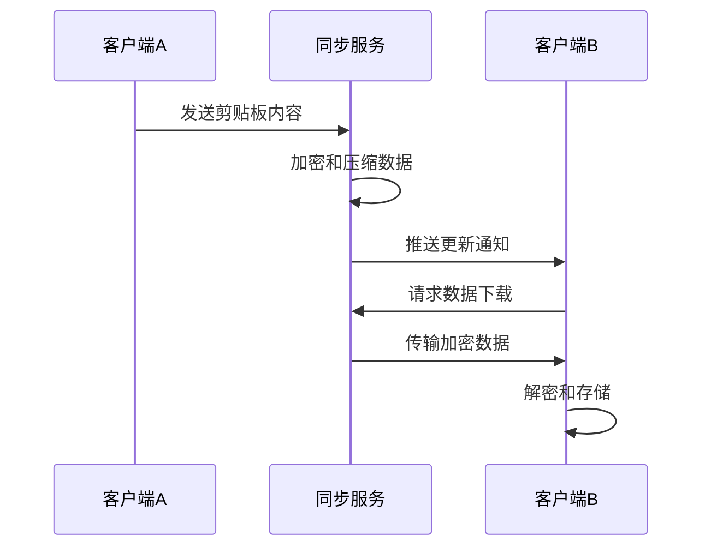

# 架构设计

本文档详细说明灵犀/MindSync的系统架构设计、技术选型和组件交互。

## 🏗️ 系统架构概览

### 整体架构图

```
┌─────────────────────────────────────────────────────────────┐
│                       客户端层 (Client Layer)                 │
├─────────────────────────────────────────────────────────────┤
│ 桌面端          移动端           浏览器扩展       第三方集成     │
│ (Electron)      (React Native)   (Chrome/Firefox)  (API/SDK)  │
└─────────────────────────────────────────────────────────────┘
                               │
                               ▼
┌─────────────────────────────────────────────────────────────┐
│                    网络传输层 (Network Layer)                 │
├─────────────────────────────────────────────────────────────┤
│   WebSocket连接        REST API         文件传输协议           │
│   (实时同步)        (配置管理)         (大文件传输)           │
└─────────────────────────────────────────────────────────────┘
                               │
                               ▼
┌─────────────────────────────────────────────────────────────┐
│                     应用服务层 (Application Layer)            │
├─────────────────────────────────────────────────────────────┤
│  认证服务    同步服务    设备管理    历史管理    消息队列       │
│  (Auth)      (Sync)     (Device)    (History)   (Message Queue)│
└─────────────────────────────────────────────────────────────┘
                               │
                               ▼
┌─────────────────────────────────────────────────────────────┐
│                      数据访问层 (Data Access Layer)           │
├─────────────────────────────────────────────────────────────┤
│  关系数据库       缓存层         文件存储        搜索引擎        │
│  (MySQL)        (Redis)        (S3/MinIO)      (Elasticsearch)│
└─────────────────────────────────────────────────────────────┘
```

## 🔧 技术栈选型

### 后端技术栈

#### 核心运行时
- **Node.js** - 高性能JavaScript运行时
- **Express.js** - Web应用框架
- **TypeScript** - 类型安全的JavaScript

#### 数据库与存储
- **MySQL 8.0+** - 关系型数据库（用户数据、设备信息）
- **Redis** - 缓存和会话存储
- **MinIO/S3** - 对象存储（文件、图片）
- **Elasticsearch** - 搜索和日志分析

#### 实时通信
- **Socket.IO** - WebSocket实时通信
- **Redis Pub/Sub** - 消息发布订阅
- **WebRTC** - P2P直连通信（可选）

#### 安全与加密
- **JWT** - 身份认证令牌
- **AES-256-GCM** - 数据加密
- **bcrypt** - 密码哈希
- **TLS 1.3** - 传输层安全

### 前端技术栈

#### 桌面客户端
- **Electron** - 跨平台桌面应用框架
- **React** - 用户界面库
- **Redux** - 状态管理
- **TypeScript** - 类型安全
- **Webpack** - 模块打包

#### 移动客户端
- **React Native** - 跨平台移动应用
- **Kotlin** - Android原生模块
- **Swift** - iOS原生模块
- **Expo** - 开发工具链

#### Web前端
- **Vue.js/React** - 前端框架
- **Vite** - 构建工具
- **Tailwind CSS** - 样式框架
- **PWA** - 渐进式Web应用

## 🏭 核心组件设计

### 1. 认证服务 (Auth Service)

#### 功能职责
- 用户注册和登录
- JWT令牌管理
- 权限验证
- 会话管理

#### 技术实现
```typescript
interface AuthService {
  register(userData: UserRegistration): Promise<User>;
  login(credentials: LoginCredentials): Promise<AuthToken>;
  verifyToken(token: string): Promise<User>;
  refreshToken(refreshToken: string): Promise<AuthToken>;
  logout(userId: string): Promise<void>;
}
```

#### 安全特性
- 多因素认证支持
- 登录尝试限制
- 会话超时控制
- 安全审计日志

### 2. 同步服务 (Sync Service)

#### 功能职责
- 剪贴板内容同步
- 冲突解决
- 数据压缩和加密
- 传输优化

#### 同步流程


#### 性能优化
- 增量同步机制
- 数据分块传输
- 连接复用
- 智能重试策略

### 3. 设备管理服务 (Device Management)

#### 功能职责
- 设备注册和发现
- 设备状态监控
- 设备间通信协调
- 设备权限管理

#### 设备状态机
```typescript
enum DeviceStatus {
  OFFLINE = 'offline',
  CONNECTING = 'connecting',
  ONLINE = 'online',
  SYNCING = 'syncing',
  ERROR = 'error'
}

interface Device {
  id: string;
  name: string;
  type: DeviceType;
  platform: Platform;
  status: DeviceStatus;
  lastSeen: Date;
  capabilities: DeviceCapabilities;
}
```

### 4. 历史记录服务 (History Service)

#### 功能职责
- 剪贴板历史存储
- 历史记录检索
- 数据清理和归档
- 搜索和过滤

#### 数据模型
```sql
CREATE TABLE clipboard_history (
  id VARCHAR(36) PRIMARY KEY,
  user_id VARCHAR(36) NOT NULL,
  content TEXT NOT NULL,
  content_type ENUM('text', 'image', 'file') NOT NULL,
  metadata JSON,
  created_at TIMESTAMP DEFAULT CURRENT_TIMESTAMP,
  updated_at TIMESTAMP DEFAULT CURRENT_TIMESTAMP ON UPDATE CURRENT_TIMESTAMP,
  INDEX idx_user_created (user_id, created_at)
);
```

## 🔄 数据流设计

### 剪贴板同步数据流

#### 1. 内容捕获
```typescript
// 客户端剪贴板监听
class ClipboardMonitor {
  startMonitoring(): void {
    // 监听系统剪贴板变化
    // 过滤重复内容
    // 触发同步流程
  }
  
  processContent(content: ClipboardContent): void {
    // 内容类型识别
    // 数据预处理
    // 调用同步服务
  }
}
```

#### 2. 数据传输
```typescript
// 同步传输协议
interface SyncProtocol {
  // 数据分块
  chunkData(content: string, chunkSize: number): string[];
  
  // 加密传输
  encryptChunk(chunk: string, key: CryptoKey): Promise<string>;
  
  // 传输确认
  confirmDelivery(chunkId: string): Promise<boolean>;
}
```

#### 3. 数据接收
```typescript
// 数据接收处理
class ContentReceiver {
  async receiveContent(encryptedData: string): Promise<void> {
    // 数据解密
    const decrypted = await this.decrypt(encryptedData);
    
    // 数据验证
    if (this.validateContent(decrypted)) {
      // 写入系统剪贴板
      await this.writeToClipboard(decrypted);
      
      // 更新本地历史
      await this.updateHistory(decrypted);
    }
  }
}
```

## 🗄️ 数据库设计

### 核心数据表

#### 用户表 (users)
```sql
CREATE TABLE users (
  id VARCHAR(36) PRIMARY KEY,
  email VARCHAR(255) UNIQUE NOT NULL,
  username VARCHAR(100),
  password_hash VARCHAR(255) NOT NULL,
  preferences JSON,
  created_at TIMESTAMP DEFAULT CURRENT_TIMESTAMP,
  updated_at TIMESTAMP DEFAULT CURRENT_TIMESTAMP ON UPDATE CURRENT_TIMESTAMP,
  last_login TIMESTAMP,
  status ENUM('active', 'inactive', 'suspended') DEFAULT 'active'
);
```

#### 设备表 (devices)
```sql
CREATE TABLE devices (
  id VARCHAR(36) PRIMARY KEY,
  user_id VARCHAR(36) NOT NULL,
  name VARCHAR(100) NOT NULL,
  type ENUM('desktop', 'mobile', 'tablet') NOT NULL,
  platform ENUM('windows', 'macos', 'linux', 'android', 'ios') NOT NULL,
  device_id VARCHAR(255) UNIQUE NOT NULL,
  public_key TEXT,
  last_seen TIMESTAMP,
  created_at TIMESTAMP DEFAULT CURRENT_TIMESTAMP,
  FOREIGN KEY (user_id) REFERENCES users(id) ON DELETE CASCADE
);
```

#### 剪贴板历史表 (clipboard_history)
```sql
CREATE TABLE clipboard_history (
  id VARCHAR(36) PRIMARY KEY,
  user_id VARCHAR(36) NOT NULL,
  device_id VARCHAR(36) NOT NULL,
  content TEXT NOT NULL,
  content_type ENUM('text', 'image', 'file', 'rich_text') NOT NULL,
  mime_type VARCHAR(100),
  size BIGINT,
  metadata JSON,
  encrypted BOOLEAN DEFAULT TRUE,
  created_at TIMESTAMP DEFAULT CURRENT_TIMESTAMP,
  FOREIGN KEY (user_id) REFERENCES users(id) ON DELETE CASCADE,
  FOREIGN KEY (device_id) REFERENCES devices(id) ON DELETE CASCADE,
  INDEX idx_user_content (user_id, created_at)
);
```

### 索引优化策略

#### 查询优化索引
```sql
-- 用户设备查询优化
CREATE INDEX idx_user_devices ON devices(user_id, last_seen);

-- 历史记录分页查询优化
CREATE INDEX idx_history_paging ON clipboard_history(user_id, created_at DESC);

-- 内容搜索优化
CREATE FULLTEXT INDEX idx_content_search ON clipboard_history(content);
```

## 🔒 安全架构

### 加密策略

#### 端到端加密流程
```typescript
class EndToEndEncryption {
  // 密钥生成
  async generateKeyPair(): Promise<CryptoKeyPair> {
    return window.crypto.subtle.generateKey(
      {
        name: "RSA-OAEP",
        modulusLength: 2048,
        publicExponent: new Uint8Array([1, 0, 1]),
        hash: "SHA-256",
      },
      true,
      ["encrypt", "decrypt"]
    );
  }
  
  // 数据加密
  async encryptData(data: string, publicKey: CryptoKey): Promise<string> {
    const encoded = new TextEncoder().encode(data);
    const encrypted = await window.crypto.subtle.encrypt(
      { name: "RSA-OAEP" },
      publicKey,
      encoded
    );
    return btoa(String.fromCharCode(...new Uint8Array(encrypted)));
  }
}
```

### 访问控制

#### 基于角色的权限控制
```typescript
enum UserRole {
  ADMIN = 'admin',
  USER = 'user',
  GUEST = 'guest'
}

enum Permission {
  READ_CLIPBOARD = 'read_clipboard',
  WRITE_CLIPBOARD = 'write_clipboard',
  MANAGE_DEVICES = 'manage_devices',
  VIEW_HISTORY = 'view_history',
  DELETE_HISTORY = 'delete_history'
}

const rolePermissions = {
  [UserRole.ADMIN]: [
    Permission.READ_CLIPBOARD,
    Permission.WRITE_CLIPBOARD,
    Permission.MANAGE_DEVICES,
    Permission.VIEW_HISTORY,
    Permission.DELETE_HISTORY
  ],
  [UserRole.USER]: [
    Permission.READ_CLIPBOARD,
    Permission.WRITE_CLIPBOARD,
    Permission.MANAGE_DEVICES,
    Permission.VIEW_HISTORY
  ]
};
```

## 📊 性能优化

### 缓存策略

#### 多级缓存架构
```typescript
class MultiLevelCache {
  private memoryCache: Map<string, any> = new Map();
  private redisClient: Redis;
  
  async get(key: string): Promise<any> {
    // 1. 检查内存缓存
    if (this.memoryCache.has(key)) {
      return this.memoryCache.get(key);
    }
    
    // 2. 检查Redis缓存
    const redisValue = await this.redisClient.get(key);
    if (redisValue) {
      // 回写到内存缓存
      this.memoryCache.set(key, redisValue);
      return redisValue;
    }
    
    // 3. 从数据库加载
    const dbValue = await this.loadFromDatabase(key);
    if (dbValue) {
      // 更新缓存
      await this.set(key, dbValue);
      return dbValue;
    }
    
    return null;
  }
}
```

### 数据库优化

#### 读写分离
```yaml
# 数据库配置
databases:
  master:
    host: db-master.example.com
    role: master
  
  replicas:
    - host: db-replica-1.example.com
      role: read
    - host: db-replica-2.example.com
      role: read
```

#### 连接池配置
```javascript
// 数据库连接池配置
const pool = mysql.createPool({
  connectionLimit: 10,
  host: 'localhost',
  user: 'mindsync',
  password: 'password',
  database: 'mindsync',
  acquireTimeout: 10000,
  timeout: 60000,
  queueLimit: 0
});
```

## 🚀 部署架构

### 容器化部署

#### Docker Compose配置
```yaml
version: '3.8'
services:
  app:
    image: mindsync/app:latest
    environment:
      - NODE_ENV=production
      - DB_HOST=db
      - REDIS_HOST=redis
    ports:
      - "3000:3000"
    depends_on:
      - db
      - redis
    
  db:
    image: mysql:8.0
    environment:
      - MYSQL_ROOT_PASSWORD=rootpass
      - MYSQL_DATABASE=mindsync
    volumes:
      - db_data:/var/lib/mysql
    
  redis:
    image: redis:6.2-alpine
    volumes:
      - redis_data:/data

volumes:
  db_data:
  redis_data:
```

### 云原生部署

#### Kubernetes部署配置
```yaml
apiVersion: apps/v1
kind: Deployment
metadata:
  name: mindsync-app
spec:
  replicas: 3
  selector:
    matchLabels:
      app: mindsync
  template:
    metadata:
      labels:
        app: mindsync
    spec:
      containers:
      - name: app
        image: mindsync/app:latest
        ports:
        - containerPort: 3000
        env:
        - name: NODE_ENV
          value: "production"
        resources:
          requests:
            memory: "256Mi"
            cpu: "250m"
          limits:
            memory: "512Mi"
            cpu: "500m"
```

## 🔄 监控与日志

### 监控指标

#### 应用性能监控
```typescript
interface PerformanceMetrics {
  // 响应时间
  responseTime: number;
  
  // 吞吐量
  requestsPerSecond: number;
  
  // 错误率
  errorRate: number;
  
  // 资源使用
  memoryUsage: number;
  cpuUsage: number;
  
  // 业务指标
  activeUsers: number;
  syncOperations: number;
  dataTransferred: number;
}
```

### 日志策略

#### 结构化日志
```json
{
  "timestamp": "2024-01-01T10:00:00Z",
  "level": "info",
  "message": "用户登录成功",
  "userId": "user_123",
  "deviceId": "device_456",
  "ipAddress": "192.168.1.100",
  "userAgent": "Mozilla/5.0...",
  "duration": 150
}
```

---

## 📈 扩展性设计

### 水平扩展策略

#### 无状态服务设计
- 所有服务实例无状态
- 会话数据存储在Redis
- 支持自动扩缩容

#### 数据分片策略
- 用户数据按用户ID分片
- 设备数据按设备类型分片
- 历史数据按时间分片

### 微服务架构演进

#### 当前单体架构
```
┌─────────────────┐
│   单体应用       │
│ (Monolithic)    │
└─────────────────┘
```

#### 目标微服务架构
```
┌─────────┐ ┌─────────┐ ┌─────────┐
│ 认证服务 │ │ 同步服务 │ │ 设备服务 │
└─────────┘ └─────────┘ └─────────┘
      │           │           │
      └───────── API网关 ──────┘
```

---

*架构版本: v1.0.0*  
*最后更新: 2024年12月*