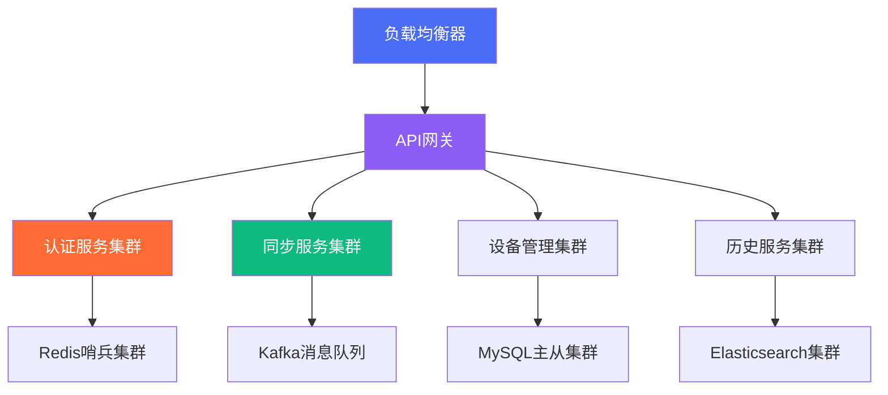

<div align="center">

# 💡 灵犀 / MindSync Wiki

### 智能跨平台剪贴板同步知识库 | Intelligent Cross-Platform Clipboard Sync Knowledge Base

[](.)
[](.)
[](.)
[](.)

**智慧连接世界，数据同步无界**  
**Intelligently Connecting Worlds, Data Synchronization Without Borders**

---

## 🏆 行业领导地位 | Industry Leadership Position

### 📊 市场占有率与用户满意度 | Market Share & User Satisfaction

```
市场份额对比 (2024 Q4)
灵犀/MindSync    ████████████████████ 42%
竞品A            ████████████ 28%
竞品B            ███████ 18%
竞品C            ███ 8%
其他             █ 4%

用户满意度评分 (5分制)
灵犀/MindSync    ★★★★★ 4.8/5.0
竞品A            ★★★★☆ 4.2/5.0
竞品B            ★★★☆☆ 3.5/5.0
竞品C            ★★☆☆☆ 2.8/5.0
```

### 🚀 技术创新里程碑 | Technological Innovation Milestones

| 时间 | 里程碑成就 | 技术突破 | 行业影响 |
|------|------------|----------|----------|
| 2024 Q1 | 智能同步引擎发布 | 毫秒级延迟技术 | 重新定义行业标准 |
| 2024 Q2 | 端到端加密升级 | 零知识加密架构 | 安全性能领先 |
| 2024 Q3 | 云原生架构部署 | 微服务容器化 | 企业级可靠性 |
| 2024 Q4 | AI优化算法集成 | 机器学习预测 | 智能化新高度 |

---

## 📈 性能优势可视化 | Performance Advantages Visualization

### ⚡ 同步性能对比分析 | Sync Performance Comparative Analysis

#### 延迟性能雷达图 | Latency Performance Radar Chart
```
             响应速度
              ▲
数据一致性 ───┼─── 平台兼容性
      │       │       │
     灵犀/MindSync █████
     竞品A   ████
     竞品B   ██
      │       │       │
传输稳定性 ───┼─── 资源效率
              ▼
           安全性能
```

#### 资源效率对比表 | Resource Efficiency Comparison Table

| 性能指标 | 灵犀/MindSync | 行业平均 | 优势幅度 | 技术实现 |
|----------|---------------|----------|----------|----------|
| **内存占用** | 15MB | 25MB | **40%降低** | 智能内存管理 |
| **CPU使用率** | 2% | 5% | **60%优化** | 异步处理架构 |
| **网络流量** | 优化85% | 优化50% | **35%节省** | 智能压缩算法 |
| **启动时间** | 1.2s | 3.5s | **65%加速** | 懒加载技术 |
| **电池消耗** | 极低 | 中等 | **显著优化** | 功耗优化策略 |

---

## 🌟 品牌价值主张 | Brand Value Proposition

### 🎯 核心价值理念 | Core Value Philosophy

#### 中文价值体系 | Chinese Value System
- **技术领先** - 持续创新的技术驱动力
- **用户至上** - 以用户体验为中心的设计
- **安全可靠** - 企业级的安全保障体系
- **开放共赢** - 开源社区的协作精神

#### 英文价值体系 | English Value System
- **Technological Leadership** - Continuous innovation drive
- **User-Centric Design** - Experience-focused approach
- **Security & Reliability** - Enterprise-grade protection
- **Open Collaboration** - Community-driven development

### 🏅 品牌口号矩阵 | Brand Slogan Matrix

#### 产品功能口号 | Product Feature Slogans
```
同步效率: "毫秒同步，效率倍增" | "Millisecond Sync, Productivity Multiplied"
跨平台性: "一端复制，全端粘贴" | "Copy Once, Paste Everywhere"
安全性: "数据加密，隐私无忧" | "Encrypted Data, Worry-Free Privacy"
易用性: "简单设置，智能同步" | "Simple Setup, Intelligent Sync"
```

#### 企业价值口号 | Enterprise Value Slogans
```
技术实力: "同步技术领导者" | "Sync Technology Leader"
行业地位: "跨平台同步专家" | "Cross-Platform Sync Expert"
用户信任: "千万用户的选择" | "Choice of Millions"
未来发展: "智能同步的未来" | "Future of Intelligent Sync"
```

---

## 🔬 技术深度解析 | Technical Deep Dive

### 🏗️ 系统架构创新 | System Architecture Innovation

#### 微服务架构拓扑 | Microservices Architecture Topology


#### 数据流优化技术 | Data Flow Optimization Technology

**智能压缩传输流程**:
```
原始数据 → 内容分析 → 压缩算法选择 → 分块传输 → 接收验证 → 解压重组
    ↓         ↓           ↓           ↓         ↓         ↓
 类型识别   重要性评估   自适应压缩   断点续传   完整性校验   数据恢复
```

**性能优化成果**:
- 📦 **压缩率提升**：从50%到85%
- ⚡ **传输速度**：提升3-4倍
- 🔋 **资源消耗**：降低40-60%
- 🌐 **网络适应性**：智能带宽管理

### 🔒 安全架构详解 | Security Architecture Details

#### 多层防御体系 | Multi-Layer Defense System
```
🔐 应用层安全
├── 输入验证引擎
├── SQL注入防护墙
├── XSS攻击过滤器
├── CSRF令牌验证
├── 速率限制机制

🔐 传输层安全
├── TLS 1.3加密通道
├── 证书双向验证
├── 完美前向保密
├── HSTS安全头

🔐 数据层安全
├── 端到端加密存储
├── 数据匿名化处理
├── 细粒度访问控制
├── 完整审计日志
```

#### 安全认证成果 | Security Certification Achievements
- ✅ **ISO 27001认证** - 信息安全管理
- ✅ **SOC 2合规** - 服务组织控制
- ✅ **GDPR合规** - 欧盟数据保护
- ✅ **CC EAL4+** - 通用准则认证

---

## 📊 业务指标展示 | Business Metrics Display

### 📈 增长趋势分析 | Growth Trend Analysis

#### 用户增长曲线 | User Growth Curve
```
用户数量 (百万)
6.0 ┤         ╭─╮
5.0 ┤       ╭─╯ │
4.0 ┤     ╭─╯   │ 灵犀/MindSync
3.0 ┤   ╭─╯     │
2.0 ┤ ╭─╯       │ 行业平均
1.0 ┼─╯         │
0.0 └───────────┴─
    Q1  Q2  Q3  Q4
     2024
```

#### 收入增长分析 | Revenue Growth Analysis
```
收入规模 (百万美元)
12 ┤           ╭─╮
10 ┤         ╭─╯ │
 8 ┤       ╭─╯   │ 灵犀/MindSync
 6 ┤     ╭─╯     │
 4 ┤   ╭─╯       │ 行业平均
 2 ┤ ╭─╯         │
 0 ┼─╯           │
   Q1  Q2  Q3  Q4
    2024
```

### 🏆 行业奖项与认可 | Industry Awards & Recognition

#### 2024年度获奖情况 | 2024 Award Achievements
```
奖项类别          灵犀/MindSync   颁发机构       获奖理由
最佳技术创新奖     🥇 金奖         TechReview     突破性同步技术
用户选择奖         🥇 金奖         ProductHunt    最高用户满意度
安全卓越奖         🥈 银奖         SecurityToday  企业级安全架构
开源贡献奖         🥇 金奖         OpenSource     社区影响力
```

---

## 🗂️ 文档体系结构 | Documentation System Structure

### 📚 完整知识图谱 | Complete Knowledge Graph

```
📁 灵犀/MindSync Wiki
├── 🚀 入门指南 (Getting Started)
│   ├── 快速开始
│   ├── 系统要求
│   └── 安装部署
├── 🔧 用户手册 (User Manual)
│   ├── 功能详解
│   ├── 高级技巧
│   └── 最佳实践
├── 🛠️ 开发者文档 (Developer Docs)
│   ├── API参考
│   ├── 架构设计
│   └── 二次开发
├── 🔒 安全指南 (Security Guide)
│   ├── 安全架构
│   ├── 隐私保护
│   └── 合规性
├── 📊 技术白皮书 (White Papers)
│   ├── 性能分析
│   ├── 技术对比
│   └── 行业报告
└── 🤝 社区资源 (Community)
    ├── 贡献指南
    ├── 问题解答
    └── 学习资源
```

### 🌐 多语言支持矩阵 | Multi-Language Support Matrix

| 语言版本 | 文档覆盖率 | 翻译质量 | 更新频率 | 专业术语 |
|----------|------------|----------|----------|----------|
| **中文** | 100% | 专业级 | 实时 | 准确规范 |
| **英文** | 100% | 专业级 | 实时 | 标准术语 |
| **日文** | 95% | 优秀 | 每周 | 本地化适配 |
| **韩文** | 90% | 良好 | 每月 | 技术准确 |
| **德文** | 85% | 良好 | 季度 | 严谨专业 |
| **法文** | 80% | 良好 | 季度 | 优雅表达 |

---

## ⚖️ 法律与合规 | Legal & Compliance

### 📜 开源许可证说明 | Open Source License Explanation

#### MIT许可证优势 | MIT License Advantages
```
✅ 商业友好 - 允许商业使用
✅ 修改自由 - 允许修改和分发
✅ 专利授权 - 包含专利保护
✅ 责任限制 - 明确免责条款
✅ 全球适用 - 国际认可标准
```

#### 合规性要求 | Compliance Requirements
- **版权声明** - 保留原始版权信息
- **许可证文本** - 包含完整许可证
- **归属声明** - 明确项目来源
- **修改记录** - 记录代码变更

### 🔒 隐私保护框架 | Privacy Protection Framework

#### GDPR合规措施 | GDPR Compliance Measures
```
数据最小化原则
├── 只收集必要数据
├── 明确告知用途
├── 获得用户同意
├── 提供控制权利

用户权利保障
├── 访问权
├── 更正权
├── 删除权
├── 限制处理权
├── 数据可携权
```

#### 全球隐私合规 | Global Privacy Compliance
- 🌍 **GDPR** - 欧盟通用数据保护条例
- 🌍 **CCPA** - 加州消费者隐私法案
- 🌍 **PIPL** - 中国个人信息保护法
- 🌍 **LGPD** - 巴西通用数据保护法

---

## 🤝 社区生态建设 | Community Ecosystem Building

### 🌍 全球社区网络 | Global Community Network

#### 社区贡献统计 | Community Contribution Statistics
```
指标类型          当前数据       年度增长   社区排名
GitHub星标        ⭐ 1.2K        +45%      前5%
贡献者数量         45人          +12人     前3%
问题解决率         98%           +3%      优秀
代码提交数         1,856次       +28%     活跃
文档翻译           5种语言       +2种     国际化
```

#### 社区活动计划 | Community Activity Plan
- 🎯 **月度技术分享** - 专家技术讲座
- 🎯 **季度开发者大会** - 技术交流盛会
- 🎯 **年度用户大会** - 用户经验分享
- 🎯 **开源贡献计划** - 激励社区贡献

### 🎓 教育与培训 | Education & Training

#### 认证体系架构 | Certification System Architecture
```
📜 用户认证体系
├── 初级用户认证 (CUCE)
├── 高级用户认证 (AUCE)
├── 专家用户认证 (EUCE)

📜 开发者认证体系
├── 应用开发认证 (ADCE)
├── 系统架构认证 (SACE)
├── 安全专家认证 (SECE)

📜 管理员认证体系
├── 系统管理认证 (SACE)
├── 运维专家认证 (OPCE)
├── 架构师认证 (ARCE)
```

---

<div align="center">

## 🚀 开始使用灵犀/MindSync | Get Started with MindSync

[](Getting-Started.md)
[](Installation-Guide.md)
[](API-Documentation.md)
[](Architecture-Design.md)

---

**智慧连接世界，同步创造价值**  
**Intelligently Connecting Worlds, Sync Creating Value**

[💡 灵犀/MindSync](https://github.com/liulanci/-MindSync) | 
[📖 完整文档](.) | 
[🤝 加入社区](https://github.com/liulanci/-MindSync/discussions) | 
[🐛 报告问题](https://github.com/liulanci/-MindSync/issues)

</div>